# User Flow Diagram

```mermaid
flowchart TD
    Start([User Visits App]) --> Login{Authenticated?}
    Login -->|No| SignIn[Sign In Page<br/>/sign-in]
    SignIn --> Auth[Enter Email/Password]
    Auth --> Validate{Valid Credentials?}
    Validate -->|No| SignIn
    Validate -->|Yes| Demo[Test Page<br/>/demo]
    
    Login -->|Yes| Demo
    
    Demo --> CheckBlueprint{Active Blueprint<br/>Exists?}
    CheckBlueprint -->|No| CreateBlueprint[Go to Blueprints<br/>/blueprints]
    CheckBlueprint -->|Yes| Upload[Upload Audio File]
    
    CreateBlueprint --> NewBlueprint[Click 'New Blueprint']
    NewBlueprint --> Editor[Blueprint Editor<br/>/blueprints/new]
    Editor --> Define[Define Stages & Behaviors]
    Define --> Save[Save as Draft]
    Save --> Publish[Publish Blueprint]
    Publish --> ValidateBP{Validation<br/>Passed?}
    ValidateBP -->|No| Editor
    ValidateBP -->|Yes| Compile[Background Compilation]
    Compile --> Published[Blueprint Published<br/>Status: published]
    Published --> Upload
    
    Upload --> Transcribe[Deepgram Transcription]
    Transcribe --> GetBlueprint[Get Active Published Blueprint]
    GetBlueprint --> Evaluate[Evaluation Pipeline]
    
    Evaluate --> Detection[Detection Engine<br/>Phase 5]
    Detection --> LLM[LLM Stage Evaluator<br/>Phase 6]
    LLM --> Scoring[Scoring Engine<br/>Phase 7]
    Scoring --> Store[Store Evaluation Results]
    
    Store --> Results[Results Page<br/>/results/:recordingId]
    Results --> View[View Stage Scores<br/>Behaviors & Violations]
    
    style Start fill:#e1f5ff
    style SignIn fill:#fff4e6
    style Demo fill:#e8f5e9
    style Editor fill:#f3e5f5
    style Published fill:#c8e6c9
    style Evaluate fill:#fff9c4
    style Results fill:#e3f2fd
```

## Flow Steps

### 1. Authentication
- User visits app → Redirected to `/sign-in` if not authenticated
- Enters email/password → Validates credentials
- On success → Redirects to `/demo` (Test page)

### 2. Blueprint Creation (Admin/QA Manager Only)
- Navigate to `/blueprints`
- Click "New Blueprint" → Opens Blueprint Editor
- Define stages and behaviors
- Save as draft → Publish blueprint
- Background compilation → Blueprint becomes active

### 3. Testing & Evaluation
- Upload audio file on `/demo` page
- Automatic transcription via Deepgram
- System fetches active published blueprint
- Evaluation pipeline runs:
  - Detection Engine (Phase 5)
  - LLM Stage Evaluator (Phase 6)
  - Scoring Engine (Phase 7)
- Results stored in database

### 4. Results Viewing
- Redirected to `/results/:recordingId`
- View comprehensive evaluation:
  - Stage scores
  - Behavior evaluations
  - Policy violations
  - Overall pass/fail status

